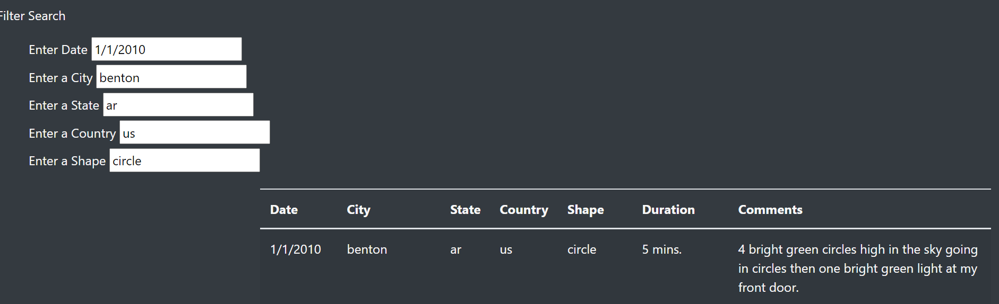

# UFOs

Overview of Project: 

The purpose of this analysis is to compile all information about UFO findings around the world onto one webpage. This promotes easy access to Dana's stakeholders and everyone else who wishes to retrieve information. 

Results: 

To use this easy-to-use webpage, scroll down to the bottom left where the filter search section is located. Then, enter in the desired key words you'd like to search for. You can fill in all fields, or just some of them. For example, you could be interested in UFO sightings on 1/13/2010. Once that is done, refresh the webpage and the result(s)will be listed next to the section where you inputed the keywords. 
In my example below, I inserted 1/1/2010 in the date section, benton in city, ar in state, us in country, and circle in shape. Then, I refreshed the webpage and the result that matched all of my inserted keywords was returned.

Summary: 

One drawback of this design is that users would have to go to the bottom of the page to filter. The whole look of the webpage appears very busy; not a lot of people would want to go to a homepage of a website that has a bunch of text. 
A recommendation would be to create tabs. For example, Google has a clean look and then tabs if you want to search for images, articles, etc. It's a lot easier on the eyes and they would be more willing to use the site. Another recommendation would be to put the article in a new tab. Just have the image and the header "The Truth Is Out There" on the homepage and nothing else. That alone is enough to capture the attention and interest of users. If they need additional information, they can go through the tabs to either read the article or use the filter search function. Having tabs would still allow the webpage to display the information we want to convey.